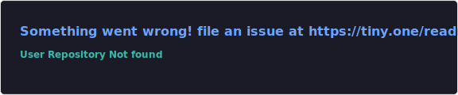

<!---
Intro.
--->

## Hi, I’m Joseph aka @zcraber! 👋

<!---
Brief bio.
--->
### About me
- 🎨 Graphic designer, translator & subtitler by profession.
- 🌱 Currently, learning web development and design.
- 💛 Love reading fiction, watching movies and football.

<!---
Portfolio
--->
### Portfolio

Below are my open-source contributions.

#### Web Apps

#### Themes & Templates
(https://github.com/digitalmalayali/linkhub-jekyll-theme)

(https://github.com/digitalmalayalistudio/unstruction-wordpress-theme)

#### Localization
Projects I've contributed as a Malayalam translator.

(https://github.com//marchellodev/sharik)

(https://github.com/digitalmalayali/pappadam)

#### Awesome List
(https://github.com/zcraber/Freebies-Hub)

(https://github.com/zcraber/powered-by-azuracast)

#### Fonts
(https://github.com/zcraber/Justins-Script)

<!---
Tech Stack
--->
### Tech Stack 
Here are the amazing technologies I'm experienced with or currently learning:

#### Languages
 

#### IDE

#### CMS
 

#### SSG

#### Hosting Panels

#### Libraries & Frameworks

#### Design & Photo Editing

#### Video/Audio Editing

#### OS

<!---
Stats
--->

